# IFRS 15 Revenue Recognition - Entity Relationship Diagram

## Modelo Completo de Domínio IFRS 15

```mermaid
erDiagram
    %% ============================================================================
    %% CORE ENTITIES - Step 1: Identify the Contract
    %% ============================================================================
    
    TENANT {
        uuid id PK
        string name
        string domain UK
        boolean is_active
        json settings
        timestamp created_at
        timestamp updated_at
    }
    
    USER {
        uuid id PK
        uuid tenant_id FK
        string email
        string name
        string[] roles
        boolean is_active
        timestamp created_at
        timestamp updated_at
    }
    
    CUSTOMER {
        uuid id PK
        uuid tenant_id FK
        string name
        string email
        string tax_id
        json address
        boolean is_active
        timestamp created_at
        timestamp updated_at
    }
    
    CONTRACT {
        uuid id PK
        uuid tenant_id FK
        uuid customer_id FK
        string contract_number UK
        string title
        string description
        date start_date
        date end_date
        decimal total_value
        string currency
        enum status
        boolean has_commercial_substance
        boolean is_enforceable
        date enforcement_period_start
        date enforcement_period_end
        timestamp created_at
        timestamp updated_at
    }
    
    CONTRACT_MODIFICATION {
        uuid id PK
        uuid tenant_id FK
        uuid contract_id FK
        string modification_number UK
        string description
        date effective_date
        enum modification_type
        decimal price_change
        string scope_change
        boolean is_approved
        timestamp created_at
        timestamp updated_at
    }
    
    CLAUSE {
        uuid id PK
        uuid contract_id FK
        enum clause_type
        string title
        string description
        json terms
        boolean is_active
        timestamp created_at
        timestamp updated_at
    }
    
    %% ============================================================================
    %% STEP 2: Performance Obligations & Promises
    %% ============================================================================
    
    PERFORMANCE_OBLIGATION {
        uuid id PK
        uuid tenant_id FK
        uuid contract_id FK
        string description
        decimal allocated_amount
        decimal recognized_amount
        boolean is_distinct
        enum satisfaction_method
        enum satisfaction_timing
        date estimated_completion_date
        decimal completion_percentage
        timestamp created_at
        timestamp updated_at
    }
    
    PROMISE {
        uuid id PK
        uuid tenant_id FK
        uuid contract_id FK
        uuid performance_obligation_id FK
        enum promise_type
        string description
        string goods_or_services
        boolean is_distinct
        string bundle_identifier
        timestamp created_at
        timestamp updated_at
    }
    
    %% ============================================================================
    %% STEP 3: Transaction Price Components
    %% ============================================================================
    
    TRANSACTION_PRICE {
        uuid id PK
        uuid tenant_id FK
        uuid contract_id FK
        decimal base_amount
        string currency
        decimal variable_amount
        decimal constrained_amount
        decimal financing_adjustment
        decimal non_cash_adjustment
        decimal total_amount
        timestamp calculation_date
        timestamp created_at
        timestamp updated_at
    }
    
    VARIABLE_CONSIDERATION {
        uuid id PK
        uuid tenant_id FK
        uuid contract_id FK
        string description
        enum estimation_method
        decimal expected_value
        decimal most_likely_amount
        boolean constraint_applied
        string constraint_reason
        json probability_assessment
        timestamp created_at
        timestamp updated_at
    }
    
    SIGNIFICANT_FINANCING_COMPONENT {
        uuid id PK
        uuid tenant_id FK
        uuid contract_id FK
        string description
        decimal interest_rate
        decimal present_value
        decimal nominal_value
        int financing_period
        decimal adjustment_amount
        timestamp created_at
        timestamp updated_at
    }
    
    MATERIAL_RIGHT {
        uuid id PK
        uuid tenant_id FK
        uuid contract_id FK
        string description
        string right_type
        boolean expected_exercise
        decimal exercise_probability
        decimal standalone_price_estimate
        string allocation_method
        timestamp created_at
        timestamp updated_at
    }
    
    WARRANTY {
        uuid id PK
        uuid tenant_id FK
        uuid contract_id FK
        enum warranty_type
        string description
        int period
        string coverage
        boolean is_assurance
        decimal service_amount
        timestamp created_at
        timestamp updated_at
    }
    
    %% ============================================================================
    %% STEP 4: Price Allocation
    %% ============================================================================
    
    STANDALONE_PRICE {
        uuid id PK
        uuid tenant_id FK
        string good_or_service
        string description
        decimal price
        string currency
        enum estimation_method
        boolean observable_price
        string market_evidence
        date effective_date
        date expiration_date
        timestamp created_at
        timestamp updated_at
    }
    
    PRICE_ALLOCATION {
        uuid id PK
        uuid tenant_id FK
        uuid contract_id FK
        uuid standalone_price_id FK
        uuid performance_obligation_id FK
        string description
        enum allocation_method
        decimal allocated_amount
        decimal allocation_percentage
        decimal discount_allocation
        decimal variable_allocation
        timestamp created_at
        timestamp updated_at
    }
    
    %% ============================================================================
    %% STEP 5: Revenue Recognition
    %% ============================================================================
    
    REVENUE_SCHEDULE {
        uuid id PK
        uuid tenant_id FK
        uuid contract_id FK
        uuid performance_obligation_id FK
        enum schedule_type
        enum recognition_method
        decimal amount
        date recognition_date
        string period
        string description
        enum status
        string journal_entry_id
        timestamp created_at
        timestamp updated_at
    }
    
    PROGRESS_METHOD {
        uuid id PK
        uuid tenant_id FK
        uuid performance_obligation_id FK
        enum method_type
        string description
        string input_method
        string output_method
        decimal total_input
        decimal completed_input
        decimal total_output
        decimal completed_output
        decimal progress_percentage
        date measurement_date
        timestamp created_at
        timestamp updated_at
    }
    
    %% ============================================================================
    %% BALANCE SHEET ITEMS
    %% ============================================================================
    
    CONTRACT_ASSET {
        uuid id PK
        uuid tenant_id FK
        uuid contract_id FK
        uuid performance_obligation_id FK
        string description
        decimal amount
        string currency
        date recognition_date
        date expected_conversion_date
        decimal impairment_amount
        timestamp created_at
        timestamp updated_at
    }
    
    CONTRACT_LIABILITY {
        uuid id PK
        uuid tenant_id FK
        uuid contract_id FK
        uuid performance_obligation_id FK
        string description
        decimal amount
        string currency
        date recognition_date
        date expected_satisfaction_date
        timestamp created_at
        timestamp updated_at
    }
    
    REFUND_LIABILITY {
        uuid id PK
        uuid tenant_id FK
        uuid contract_id FK
        string description
        decimal amount
        string currency
        decimal refund_probability
        date expected_refund_date
        timestamp created_at
        timestamp updated_at
    }
    
    %% ============================================================================
    %% COST TRACKING
    %% ============================================================================
    
    INCREMENTAL_COST {
        uuid id PK
        uuid tenant_id FK
        uuid contract_id FK
        enum cost_type
        string description
        decimal amount
        string currency
        date incurred_date
        int amortization_period
        decimal amortized_amount
        decimal remaining_amount
        decimal impairment_amount
        date recovery_test_date
        boolean is_recoverable
        timestamp created_at
        timestamp updated_at
    }
    
    AMORTIZATION_ENTRY {
        uuid id PK
        uuid incremental_cost_id FK
        string period
        decimal amortization_amount
        date amortization_date
        string journal_entry_id
        timestamp created_at
        timestamp updated_at
    }
    
    %% ============================================================================
    %% BILLING & INVOICING
    %% ============================================================================
    
    INVOICE {
        uuid id PK
        uuid tenant_id FK
        uuid contract_id FK
        string invoice_number UK
        string description
        decimal amount
        string currency
        date issue_date
        date due_date
        date paid_date
        enum status
        decimal tax_amount
        decimal discount_amount
        decimal total_amount
        timestamp created_at
        timestamp updated_at
    }
    
    BILLING_SCHEDULE {
        uuid id PK
        uuid tenant_id FK
        uuid contract_id FK
        string description
        enum schedule_type
        enum frequency
        decimal amount
        string currency
        date start_date
        date end_date
        date next_billing_date
        boolean is_active
        timestamp created_at
        timestamp updated_at
    }
    
    RECEIPT {
        uuid id PK
        uuid tenant_id FK
        uuid invoice_id FK
        string receipt_number UK
        decimal amount
        string currency
        enum payment_method
        date payment_date
        string bank_reference
        string notes
        timestamp created_at
        timestamp updated_at
    }
    
    %% ============================================================================
    %% AUDIT TRAIL
    %% ============================================================================
    
    AUDIT_TRAIL {
        uuid id PK
        uuid tenant_id FK
        uuid user_id FK
        enum action
        string entity_type
        string entity_id
        json old_values
        json new_values
        string ip_address
        string user_agent
        string session_id
        timestamp timestamp
        timestamp created_at
    }
    
    POLICY_SNAPSHOT {
        uuid id PK
        uuid tenant_id FK
        string policy_type
        string policy_name
        string version
        json content
        date effective_date
        date expiration_date
        boolean is_active
        string created_by
        timestamp created_at
        timestamp updated_at
    }
    
    %% ============================================================================
    %% RELATIONSHIPS
    %% ============================================================================
    
    %% Core Entity Relationships
    TENANT ||--o{ USER : "has"
    TENANT ||--o{ CUSTOMER : "has"
    TENANT ||--o{ CONTRACT : "has"
    CUSTOMER ||--o{ CONTRACT : "signs"
    CONTRACT ||--o{ CONTRACT_MODIFICATION : "modified_by"
    CONTRACT ||--o{ CLAUSE : "contains"
    
    %% Performance Obligations
    TENANT ||--o{ PERFORMANCE_OBLIGATION : "has"
    CONTRACT ||--o{ PERFORMANCE_OBLIGATION : "contains"
    PERFORMANCE_OBLIGATION ||--o{ PROMISE : "fulfilled_by"
    
    %% Transaction Price
    TENANT ||--o{ TRANSACTION_PRICE : "has"
    CONTRACT ||--o{ TRANSACTION_PRICE : "has"
    CONTRACT ||--o{ VARIABLE_CONSIDERATION : "has"
    CONTRACT ||--o{ SIGNIFICANT_FINANCING_COMPONENT : "has"
    CONTRACT ||--o{ MATERIAL_RIGHT : "grants"
    CONTRACT ||--o{ WARRANTY : "provides"
    
    %% Price Allocation
    TENANT ||--o{ STANDALONE_PRICE : "defines"
    TENANT ||--o{ PRICE_ALLOCATION : "has"
    CONTRACT ||--o{ PRICE_ALLOCATION : "allocates"
    STANDALONE_PRICE ||--o{ PRICE_ALLOCATION : "allocated_in"
    PERFORMANCE_OBLIGATION ||--o{ PRICE_ALLOCATION : "receives"
    
    %% Revenue Recognition
    TENANT ||--o{ REVENUE_SCHEDULE : "has"
    CONTRACT ||--o{ REVENUE_SCHEDULE : "generates"
    PERFORMANCE_OBLIGATION ||--o{ REVENUE_SCHEDULE : "recognized_in"
    PERFORMANCE_OBLIGATION ||--o{ PROGRESS_METHOD : "measured_by"
    
    %% Balance Sheet
    TENANT ||--o{ CONTRACT_ASSET : "has"
    CONTRACT ||--o{ CONTRACT_ASSET : "creates"
    PERFORMANCE_OBLIGATION ||--o{ CONTRACT_ASSET : "generates"
    
    TENANT ||--o{ CONTRACT_LIABILITY : "has"
    CONTRACT ||--o{ CONTRACT_LIABILITY : "creates"
    PERFORMANCE_OBLIGATION ||--o{ CONTRACT_LIABILITY : "generates"
    
    CONTRACT ||--o{ REFUND_LIABILITY : "may_have"
    
    %% Cost Tracking
    TENANT ||--o{ INCREMENTAL_COST : "incurs"
    CONTRACT ||--o{ INCREMENTAL_COST : "generates"
    INCREMENTAL_COST ||--o{ AMORTIZATION_ENTRY : "amortized_via"
    
    %% Billing & Invoicing
    TENANT ||--o{ INVOICE : "issues"
    CONTRACT ||--o{ INVOICE : "billed_via"
    INVOICE ||--o{ RECEIPT : "paid_via"
    CONTRACT ||--o{ BILLING_SCHEDULE : "scheduled_via"
    
    %% Audit
    TENANT ||--o{ AUDIT_TRAIL : "logs"
    USER ||--o{ AUDIT_TRAIL : "performs"
    TENANT ||--o{ POLICY_SNAPSHOT : "maintains"
```

## Resumo do Modelo

### **Entidades Principais (42 tabelas)**

#### **1. Entidades Core (6 tabelas)**
- `Tenant` - Multi-tenancy
- `User` - Usuários do sistema  
- `Customer` - Clientes
- `Contract` - Contratos com clientes
- `ContractModification` - Modificações contratuais
- `Clause` - Cláusulas contratuais

#### **2. Obrigações de Performance (2 tabelas)**
- `PerformanceObligation` - Obrigações de performance
- `Promise` - Promessas dentro das obrigações

#### **3. Preço da Transação (4 tabelas)**
- `TransactionPrice` - Preço da transação
- `VariableConsideration` - Consideração variável
- `SignificantFinancingComponent` - Componentes de financiamento
- `MaterialRight` - Direitos materiais
- `Warranty` - Garantias

#### **4. Alocação de Preço (2 tabelas)**
- `StandalonePrice` - Preços standalone
- `PriceAllocation` - Alocação de preços

#### **5. Reconhecimento de Receita (2 tabelas)**
- `RevenueSchedule` - Cronograma de reconhecimento
- `ProgressMethod` - Métodos de progresso

#### **6. Balanço Patrimonial (3 tabelas)**
- `ContractAsset` - Ativos contratuais
- `ContractLiability` - Passivos contratuais  
- `RefundLiability` - Passivos de reembolso

#### **7. Rastreamento de Custos (2 tabelas)**
- `IncrementalCost` - Custos incrementais
- `AmortizationEntry` - Entradas de amortização

#### **8. Faturamento (3 tabelas)**
- `Invoice` - Faturas
- `BillingSchedule` - Cronograma de faturamento
- `Receipt` - Recibos

#### **9. Auditoria (2 tabelas)**
- `AuditTrail` - Trilha de auditoria
- `PolicySnapshot` - Snapshots de políticas

### **Características do Modelo**

- **✅ Multi-tenant**: Isolamento completo por `tenant_id`
- **✅ IFRS 15 Compliant**: Implementa todos os 5 passos
- **✅ Auditável**: Trilha completa de mudanças
- **✅ Escalável**: Suporta contratos complexos
- **✅ Flexível**: Adaptável a diferentes indústrias
- **✅ Seguro**: RLS policies implementadas

### **Enums Implementados (16 tipos)**

1. `ContractStatus` - Status do contrato
2. `SatisfactionMethod` - Método de satisfação
3. `PromiseType` - Tipo de promessa
4. `VariableConsiderationMethod` - Método de consideração variável
5. `WarrantyType` - Tipo de garantia
6. `StandalonePriceMethod` - Método de preço standalone
7. `AllocationMethod` - Método de alocação
8. `RevenueScheduleType` - Tipo de cronograma
9. `RevenueRecognitionMethod` - Método de reconhecimento
10. `RevenueRecognitionStatus` - Status do reconhecimento
11. `ProgressMethodType` - Tipo de método de progresso
12. `IncrementalCostType` - Tipo de custo incremental
13. `InvoiceStatus` - Status da fatura
14. `BillingFrequency` - Frequência de faturamento
15. `PaymentMethod` - Método de pagamento
16. `AuditAction` - Ação de auditoria
